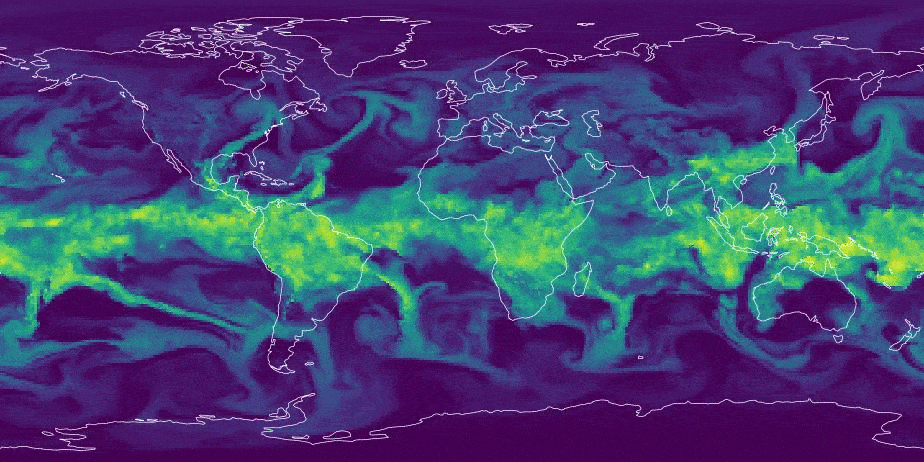

# AI Weather Forecast Visualization



This repository provides tools to simulate and visualize forecasts from AI-based NWP models, namely GenCast and Pangu-Weather.

## 📦 Features

- Run simulations using ECMWF's [ai-models](https://github.com/ecmwf-lab/ai-models) package.
- Visualize forecasted fields (e.g., temperature, wind components) across multiple pressure levels and time steps.
- Interactive React application with controls for field selection, time step navigation, rotation, and animation speed.

## 🛠️ Setup

1. **Clone the Repository**

   ```bash
   git clone https://github.com/yourusername/ai-weather-forecast.git
   cd ai-weather-forecast

2. **Install Dependencies & Run Simulations**

Go to the `gencast` and `panguweather` folders to install required packges and run the simulations.

3. **Produce maps and run the React app**

```bash
cd viz-weather-forecast
npm install
npm run dev
```